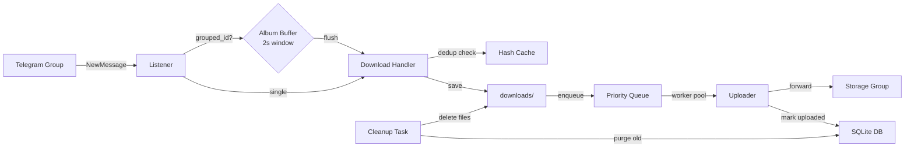

<div align="center">

# Telegram DL Guard

### High-Performance Media Downloader & Auto-Uploader for Telegram

[](https://python.org)
[](https://github.com/LonamiWebs/Telethon)
[](LICENSE)
[]()

---

**Real-time media interception** from Telegram groups with concurrent downloads,
intelligent deduplication, auto-upload to storage, and a beautiful terminal UI.

[Features](#features) · [Quick Start](#quick-start) · [Configuration](#configuration) · [Architecture](#architecture)

</div>

> [!CAUTION]
> **DISCLAIMER & LIABILITY WARNING**: This Software is provided for **educational and personal archiving/backup purposes only**. 
> - **Content Copyright**: The user is solely responsible for all downloaded/uploaded files. The developer does not encourage or condone copyright infringement or unauthorized distribution of private materials.
> - **Telegram ToS**: Automating user accounts violates Telegram API guidelines. The developer is NOT responsible for account suspensions, bans, rate limits, or data loss. Use at your own risk.
> - **No Warranty**: This software is provided "as is" with no warranty or liability of any kind.

---

## Features

<table>
<tr>
<td width="50%">

### Core
- **Real-time Listener** — Intercepts media the instant it's posted
- **Concurrent Downloads** — Parallel download pool with configurable queue
- **Auto-Upload** — Forward downloaded media to a private storage group
- **History Scanner** — Scan and download past messages (List or Auto mode)

</td>
<td width="50%">

### Intelligence
- **Smart Deduplication** — SHA-256 hash + file-size fallback detection
- **Album Grouping** — Custom 2s buffered flusher for 100% album capture
- **Super Grabber** — One-click bypass of all filters for maximum capture

</td>
</tr>
<tr>
<td>

### Interface
- **Terminal UI (TUI)** — Rich dashboard built with [Textual](https://textual.textualize.io/)
- **Live Progress** — Real-time download/upload bars with speed & ETA
- **In-App Settings** — Configure everything without touching config files
- **Telegram Commands** — `/status`, `/stats`, `/pause`, `/resume` via bot

</td>
<td>

### Performance
- **WAL + Indexed SQLite** — Thread-safe DB with RAM-backed I/O
- **Priority Queue** — FIFO / size-ascending / size-descending ordering
- **Exponential Backoff** — Retry with jitter for FloodWait resilience
- **Auto-Purge** — Periodic cleanup of stale records + VACUUM

</td>
</tr>
</table>

---

## Architecture

```
telegram-dl-guard/
├── run.py                 # Cross-platform launcher (CLI args supported)
├── run.bat                # Windows quick-start menu
├── listener.py            # Event loop: message interception, album buffer, download orchestration
├── uploader.py            # Upload worker pool, caption builder, retry logic, async webhook dispatcher
├── config.py              # Unified config loader (.env + config.yaml)
├── config.yaml            # Non-secret settings
├── .env                   # Secrets (API credentials, session string)
│
├── core/
│   ├── state.py           # SQLite WAL persistence (download tracker, group cache, LRU HashCache)
│   ├── download_handler.py# File resolver, hash dedup, parent path safety
│   ├── history.py         # Historical message scanner (fast cached mode)
│   ├── cleanup.py         # Periodic file, DB & empty directory cleanup tasks
│   ├── commands.py        # Telegram bot command handler
│   └── utils.py           # Shared utilities
│
├── tui/                   # Decoupled TUI Package Component
│   ├── app.py             # Main Textual GuardApp (online indicator, background threads)
│   ├── styles.css         # Styling rules for terminal widgets
│   └── screens/
│       ├── __init__.py    # Layout panel exports
│       ├── dashboard.py   # Dashboard monitoring Left & Right panels
│       ├── settings.py    # Configuration forms fields
│       └── gallery.py     # Directory explorer (non-blocking image previews)
│
├── downloads/             # Media landing zone (gitignored)
└── logs/                  # SQLite DB + log files (gitignored)
```

### Data Flow



---

## Quick Start

### Prerequisites

- **Python 3.10+**
- Telegram API credentials from [my.telegram.org/apps](https://my.telegram.org/apps)

### 1. Clone & Install

```bash
git clone https://github.com/YOUR_USERNAME/telegram-dl-guard.git
cd telegram-dl-guard

# Create virtual environment
python -m venv venv

# Activate (Windows)
venv\Scripts\activate

# Activate (Linux/macOS)
source venv/bin/activate

# Install dependencies
pip install -r requirements.txt
```

### 2. Configure Secrets

```bash
cp .env.example .env
```

Edit `.env` with your credentials:

```env
API_ID=12345678
API_HASH=your_api_hash_here
SESSION_STRING=           # Auto-filled after first login
```

### 3. Launch

```bash
# Interactive menu
python run.py

# Or launch directly
python run.py tui       # Terminal UI dashboard
python run.py listen    # Headless listener mode
python run.py setup     # First-time session setup
```

**Windows users** can also double-click `run.bat` for a quick-start menu.

---

## Configuration

Configuration uses a layered system: `.env` (secrets, highest priority) → `config.yaml` (defaults).

### config.yaml

```yaml
# Target groups to monitor (comma-separated group IDs)
target_groups: "-100123456789"
media_types: "photo,video"          # photo, video, doc
download_dir: "./downloads"

# Deduplication
dedup:
  enabled: true
  method: "size"                    # "size" or "hash"
  redownload: "never"

# History scanner
history:
  enabled: false
  hours: 24                         # Scan last N hours
  mode: "list"                      # "list" = interactive | "auto" = download all
  reverse: true                     # true = oldest first

# Concurrent downloads
download:
  max_concurrent: 3
  priority: "fifo"                  # fifo | size_asc | size_desc

# Auto-upload to storage
storage_group_id: "-100987654321"
upload:
  enabled: false
  workers: 3                        # 1-5 concurrent upload slots

# Cleanup
cleanup:
  enabled: false
  retention_days: 30
  interval_hours: 6

# Filter
filter:
  min_file_size: 0                  # KB (0 = no minimum)
  max_file_size: 0                  # MB (0 = no limit)
  blocked_senders: ""               # comma-separated
  super_grabber: false              # bypass ALL filters

# Display
display:
  show_speed: true
  show_eta: true
```

### Environment Variables

All `config.yaml` keys can be overridden via environment variables:

| Variable | Description | Default |
|----------|-------------|---------|
| `API_ID` | Telegram API ID | — |
| `API_HASH` | Telegram API Hash | — |
| `SESSION_STRING` | Telethon session string | — |
| `TARGET_GROUPS` | Group IDs to monitor | — |
| `MEDIA_TYPES` | `photo,video,doc` | `photo,video` |
| `DOWNLOAD_DIR` | Download path | `./downloads` |
| `DEDUP_ENABLED` | Enable deduplication | `true` |
| `QUEUE_SIZE` | Max concurrent downloads | `3` |
| `UPLOAD_ENABLED` | Auto-upload toggle | `false` |
| `STORAGE_GROUP_ID` | Upload destination | — |
| `UPLOAD_WORKERS` | Concurrent uploads | `3` |
| `SUPER_GRABBER_MODE` | Bypass all filters | `false` |
| `CLEANUP_ENABLED` | Periodic cleanup | `false` |
| `LOG_LEVEL` | `DEBUG/INFO/WARNING/ERROR` | `INFO` |

---

## Telegram Commands

When running in listener mode, the bot responds to these commands in your Telegram chat:

| Command | Description |
|---------|-------------|
| `/status` | Current download/upload activity |
| `/stats` | Total files, sizes, upload progress |
| `/pause` | Pause the download listener |
| `/resume` | Resume the download listener |

---

## Super Grabber Mode

When enabled, Super Grabber **bypasses all restrictions**:

- File size limits (`min_file_size`, `max_file_size`)
- Media type filters (`media_types`)
- Blocked sender list (`blocked_senders`)
- All filter evaluations

Enable via TUI settings toggle or set `SUPER_GRABBER_MODE=true` in `.env`.

Designed for scenarios where you need **every single file** from a group without exception.

---

## Album Grouping System

Telegram's native album events are unreliable — messages arrive in separate packets causing split groups and missing files.

DL Guard uses a **custom in-memory buffering system**:

1. Messages with `grouped_id` are collected into `ALBUM_BUFFER`
2. A 2-second timer starts on the first message of each group
3. Subsequent messages append to the same buffer
4. On timeout, all parts are sorted chronologically and processed together
5. Result: **100% album capture rate** with correct ordering

---

## Database

SQLite with WAL mode for concurrent read/write safety.

### Tables

| Table | Purpose |
|-------|---------|
| `processed_messages` | Tracks message IDs to prevent reprocessing |
| `group_cache` | Caches group ID → title mappings |
| `download_tracker` | Full lifecycle: download path, size, upload status, hash |

### Performance Tuning

- **Indexes** on `file_hash` and `uploaded` for fast lookups
- **`cache_size = 2MB`** RAM-backed page cache
- **`temp_store = MEMORY`** — temp tables stay in RAM
- **Auto-purge**: processed messages >7 days, uploaded records >30 days + `VACUUM`

---

## Cleanup System

Two cleanup mechanisms run in the background:

1. **Retention Cleanup** — Deletes files older than `cleanup_retention_days` and removes empty directories
2. **Aggressive Upload Cleanup** — Every 5 minutes, deletes local files already uploaded to storage (when upload mode is `*_delete`)
3. **DB Purge** — Automatically clears stale database records and reclaims disk space via `VACUUM`

---

## Privacy, Security & Trademark Notice

### 1. Zero Telemetry & Privacy Guarantee
This application is **100% local, offline-first, and open-source**. It contains **no telemetry, no tracking, and no analytics**. 
- The developer does **not** collect, store, or process any of your personal data, session files (`.session`), download histories, or API credentials. 
- All credentials and files are stored strictly on your local machine.

### 2. Unofficial Fork Warning
ONLY download this Software from the official repository: [github.com/ChokechaiXD/telegram-dl-guard](https://github.com/ChokechaiXD/telegram-dl-guard). 
- The developer accepts **no responsibility or liability** for modified, third-party, or unofficial forks. 
- Unofficial forks may contain security vulnerabilities, backdoors, credential-harvesting malware, or modified licenses.

### 3. Trademark Disclaimer
This Software is an unofficial third-party client. It is **not** affiliated with, authorized, sponsored, endorsed by, or in any way associated with Telegram FZ-LLC, Telegram Messenger LLP, or any of their affiliates. The name "Telegram" is a registered trademark of its respective owners.

---

## Requirements

```
Telethon==1.43.2
python-dotenv==1.2.2
PyYAML==6.0.3
rsa==4.9.1
pyaes==1.6.1
pyasn1==0.6.3
textual==8.2.7
Pillow>=12.0.0
```

---

## Contributing

1. Fork the repository
2. Create a feature branch (`git checkout -b feature/amazing-feature`)
3. Commit your changes (`git commit -m 'Add amazing feature'`)
4. Push to the branch (`git push origin feature/amazing-feature`)
5. Open a Pull Request

---

## Support & Tip Me

If this project has saved you time, disk space, or made your media archiving smoother, consider buying the developer a coffee or tipping! Your support helps keep this tool free, secure, and actively updated.

> [!TIP]
> - **Buy Me a Coffee**: [buymeacoffee.com/Chokechai](https://www.buymeacoffee.com/Chokechai)

---

## License

This project is licensed under the Non-Commercial Personal Use License — see the [LICENSE](LICENSE) file for details. Any commercial use, monetization, or selling of this application is strictly prohibited.

---

<div align="center">

**Built with Python · Telethon · Textual**

</div>
